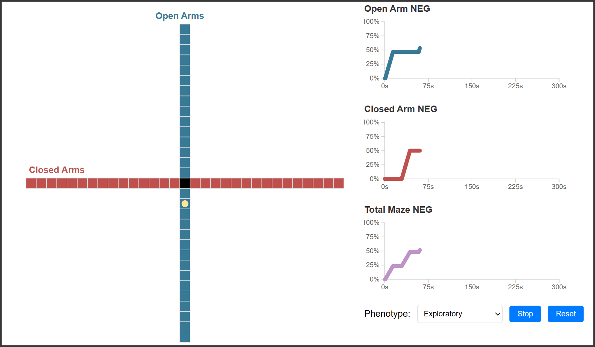

# Novel Exploration Growth (NEG)

Welcome to the repository for the project associated with the publication **"Resolving anxiety-like behaviour inconsistencies in the elevated plus maze by tracking exploration depth and timing"**. This repository contains the code and data analysis tools used in the research.

## Novel Exploration Growth as a measure of Anxiety-like Behaviour

Novel Exploration Growth (NEG) takes the theoretical motivations of approach and avoidance that underpin the conflict prompted by arenas like the Elevated Plus Maze and maps them to a single, coherent measure of anxiety-like behaviour. To understand this, consider a conventional measure such as time spent in the open arms. We break this into avoiding, exploring and preferencing the open arms, where exploration is the first visit to each part of the arms. The cumulative percentage of these naive visits is our new measure NEG:

 

 

Once we have the NEG time series, we can use the differences between arm types to infer the level of anxiety-like behaviour that is observed:

 

### *Click the preview image below to view a interactive visualisation of how phenotypical movements in the maze are mapped to the NEG by arm type and for the total maze*
 

 
 

## Repository Structure

### Current Version (v2.0)
- **analysis/**: Current analysis workflows (Quarto documents)
  - `NEG_Calc.qmd`: Processes XY coordinate time series data into NEG time series
  - `MCP_Comp.qmd`: Bayesian change-point analysis for phasic exploration patterns
  - `GAM_Reg.qmd`: Bayesian GAM analysis for comparing effects of interest
- **R/**: Preprocessing functions and utilities
  - `preprocess.R`: Core preprocessing functions including coordinate alignment correction
- **test_data/**: Example datasets for testing and validation
- **visualisations/**: Interactive web-based visualization demonstrating mouse behavior patterns
- **Images/**: Figures and visualization assets

### Legacy Versions
- **legacy/v1/**: Original implementation (deprecated)

## Key Features

- **Pre-processing:** Pre-process coordinates into Novel Exploration Growth over time
    - Pre-processing includes a custom function that detects when XY coordinates for individual samples are not aligned with origin (0,0) and uses a clustering algorithm to shift the location based on where the centre zone points are located     
- **Bayesian Change-point Analysis** Localise change-points in each time series to evaluate phasic nature of exploration
    - This is completed primarily through the use of the [mcp](https://lindeloev.github.io/mcp/) package  
- **Bayesian Generalised Additive Model Analysis** Compare effects of interest using GAM models
    - This is completed primarily through the use of the [brms](https://paul-buerkner.github.io/brms/) and [mgcv](https://www.maths.ed.ac.uk/~swood34/mgcv/) packages   

## Usage

Users will first process raw trial data, including shifting coordinates to ensure all trials overlap so that a grid can be created and utilised via **analysis/NEG_Calc.qmd**. The change points in the NEG time series will then be assessed via **analysis/MCP_Comp.qmd** to establish their phasic properties. Finally, the NEG time series will be analysed using either **analysis/GAM_Reg.qmd** or a generalised linear regression model with a binomial link family in brms (Frequentist alternatives using mgcv are also provided). Packages such as [bayestestR](https://easystats.github.io/bayestestR/) and [emmeans](https://github.com/rvlenth/emmeans) can then be used to estimate and visualise effects of interest.

For a more detailed workflow, see the publication below. 

## Running the test analysis

Each quarto document contains test data that can be processed in a chunk-by-chunk fashion or rendered as a HTML document (see NEG_Calc.html as an example).
- NEG_Calc.qmd uses test data stored in excel spreadsheets similar to ones generated from the Ethovision software
- MCP_Comp.qmd and GAM_Reg.qmd both use simulated data that mimics what is processed in NEG_Calc.qmd

## Citation

If you use this code or find the results of our research helpful, please cite our publication:

> Zelko, M; Robinson, S.R; Hill-Yardin, E, Nasser, H. "Novel Exploration Growth Quantifies Anxiety-like Behaviour in the Elevated Plus Maze,".
> Preprint available at https://biorxiv.org/cgi/content/short/2024.06.10.598202v2

**Update 28/05/2025:** The paper has been accepted into Behavior Research Methods. Updated links to follow

## Version History

- **v2.0** (Current): Streamlined analysis workflows with improved preprocessing
- **v1.0** (Legacy): Original implementation (archived in `legacy/v1/`)

## License

This project is licensed under the MIT License. See the [LICENSE](LICENSE) file for details.

## Contact

For any questions or feedback, please open an issue in this repository or contact us at mattdzelko@gmail.com.

---