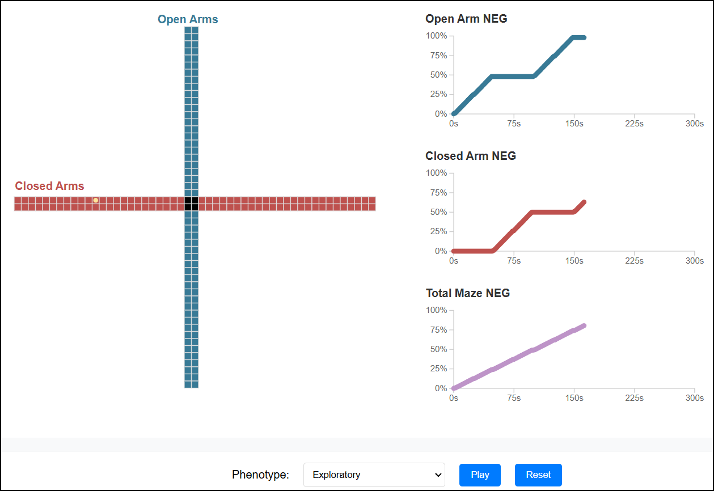

# Novel Exploration Growth (NEG)

## Introduction

Welcome to the repository for the project associated with the publication **"Novel Exploration Growth Quantifies Anxiety-like Behaviour in the Elevated Plus Maze"**. This repository contains the code and data analysis tools used in the research.

## Novel Exploration Growth as a measure of Anxiety-like Behaviour

Novel Exploration Growth (NEG) takes the theoretical motivations of approach and avoidance that underpin the conflict prompted by arenas like the Elevated Plus Maze and maps them to a single, coherent measure of anxiety-like behaviour. To understand this, consider a conventional measure such as time spent in the open arms. We break this into "Avoiding" and "Exploring" them, where exploration is the first visit to each part of the arms. The cumulative percentage of these visits is NEG:

 

 

Once we have the NEG time series, we can use the differences between arm types to infer the level of anxiety-like behaviour that is observed:

 
 

### *Click the preview image below to view a interactive visualisation of how phenotypical movements in the maze are mapped to the NEG by arm type and for the total maze*
 

 
 

## Repository Overview

- **NEG_Calc.qmd:** Quarto document used to processes XY coordinate time series data into NEG time series for the total maze and by arm type (Open, Closed)
- **XYTest.csv:** CSV file for testing NEG_Calc and to show required raw data strcture including column names
- **MCP_Comp.qmd** Quarto document showing how to model and compare single and dual phase change point models to data using a simulated dataset
- **GAM_Reg.qmd** Quarto document showing how to assess effects of interest on exploration growth using Bayesian generalised additive regression on a simulated dataset 

## Key Features

- **Pre-processing:** Pre-process coordinates into Novel Exploration Growth over time
- **Bayesian Change-point Analysis** Localise change-points in each time series to evaluate phasic nature of exploration
    - This is completed primarily through the use of the [mcp](https://lindeloev.github.io/mcp/) package  
- **Bayesian Generalised Additive Model Analysis** Compare effects of interest using GAM models
    - This is completed primarily through the use of the [brms](https://paul-buerkner.github.io/brms/) and [mgcv](https://www.maths.ed.ac.uk/~swood34/mgcv/) packages   

## Usage

Users will first establish NEG time series via **NEG_Calc.qmd**. The change points in the NEG time series will then be assessed via **MCP_Comp.qmd** to establish their phasic properties. Finally, the NEG time series will be analysed using either **GAM_Reg.qmd** or a generalised linear regression model with a binomial link family in brms (Frequentist alternatives uing mgcv are also provided). Packages such as [bayestestR](https://easystats.github.io/bayestestR/) and [emmeans](https://github.com/rvlenth/emmeans) can then be used to estimate and visualise effects of interest.

For a more detailed workflow, see the publication below. 

## Citation

If you use this code or find the results of our research helpful, please cite our publication:

> Zelko, M; Robinson, S.R; Hill-Yardin, E, Nasser, H. "Novel Exploration Growth Quantifies Anxiety-like Behaviour in the Elevated Plus Maze,".
> Preprint available at https://biorxiv.org/cgi/content/short/2024.06.10.598202v2

## License

This project is licensed under the MIT License. See the [LICENSE](LICENSE) file for details.

## Contact

For any questions or feedback, please open an issue in this repository or contact us at mattdzelko@gmail.com.

---
